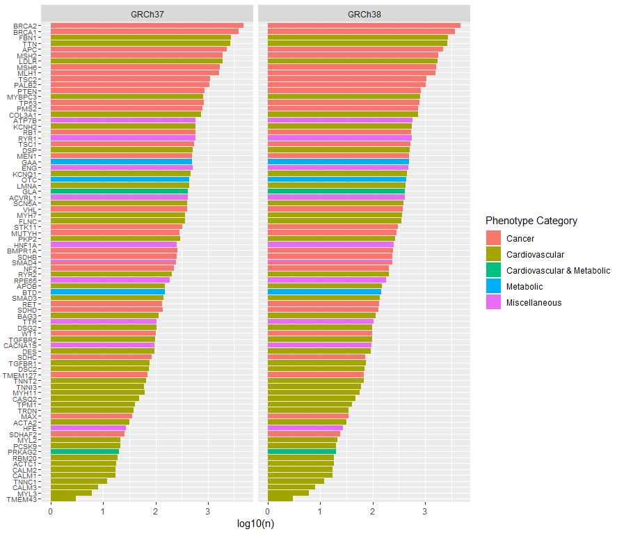

# GenotypeFilters
This repository contains scripts and reference data for filtering genotype data. 

## SNPplatforms
This section describes a filtering script for selecting the SNPs matching a particular genotype array, e.g. Illumina's Infinium Omni 2.5Exome v1.5 array. The script is run using bash shell, R and the Genome Analysis Toolkit (GATK). The genotype array is given as a gzipped interval list, which is provided in the folder in .gz format. 


### Usage
```
Usage: elegant_filter_gatk.sh [-h] 
    -i | --input-vcf       - Variant call format input file (.vcf or .vcf.gz).
    -hg | --human-genome   - Specifies the human genome reference version to use. Accepts either 37 or 38. Default: 37.
    -p | --positions       - Path to interval list of positions to include in gzipped format. The file contains columns snpID, rsID (if available) and position given as zero-indexed. Be sure to download the file matching your reference genome. 
    -g | --gatk-path       - Path to the gatk toolkit. Default: gatk.
    -p | --padding         - Number of bases to add padding around the included intervals. Default: 1.
    -o | --out             - Output path for the filtered file.
    -h | --help            - Print Usage message.

```


## ACMG filter
Initially, the ACMG filter has been created. This will take in vcf format genotype data files and exclude all variants that match positions in the accompanying ```clinvar_acmg3.2_subset.txt.gz```. The positions are listed with both assembly GRCh37 and 38, but the python program ```match_filter_vcf.py``` has the flag ```--human-genome```, where one of the two can be specified. 

The list of ACMG variants was created by linking the ACMG variants to ClinVar. 


### Requirements and recommendations
The ACMGfilter script requires 
- python >=3.9
- pandas >=2
- pyarrow backend for pandas v2

It is recommended to subset the input vcf file by chromosome and run the chromosomes in parallel. The input vcf file must have a header (```['#CHROM', 'POS', 'ID', 'REF', 'ALT', 'QUAL', 'FILTER', 'INFO', 'FORMAT', ... samples]```) and optionally the vcf format info lines started by "##". 


### Usage 
```
usage: match_filter_vcf.py [-h] --input-vcf INPUT_FILE
                           [--human-genome {37,38,37,38}]
                           [--acmg-list ACMG_PATH] [--snps-only] --output-vcf
                           OUTPUT_FILE

Program to filter genotype data (vcf format files) for ACMG actionable
variants.

optional arguments:
  -h, --help            show this help message and exit
  --input-vcf INPUT_FILE
                        Path to input variant call format (.vcf) file containing variants to
                        be filtered.
  --human-genome {37,38,37,38}
                        Specifies the human genome reference version to use.
                        Accepts either 37 or 38. Default is 37.
  --acmg-list ACMG_PATH
                        Path to the file containing the ACMG v3.2 variants to
                        be excluded. The file must be long format and contain
                        positions in both GRCh37 and 38 coordinates
                        (colname=Assembly). Furthermore it must contrain the
                        columns Assembly, Chromosome and PositionVCF.
  --snps-only           If specified, only SNPs will be kept in the filtered
                        file.
  --output-vcf OUTPUT_FILE
                        Path to output vcf format file containing filtered
                        variants.
```


